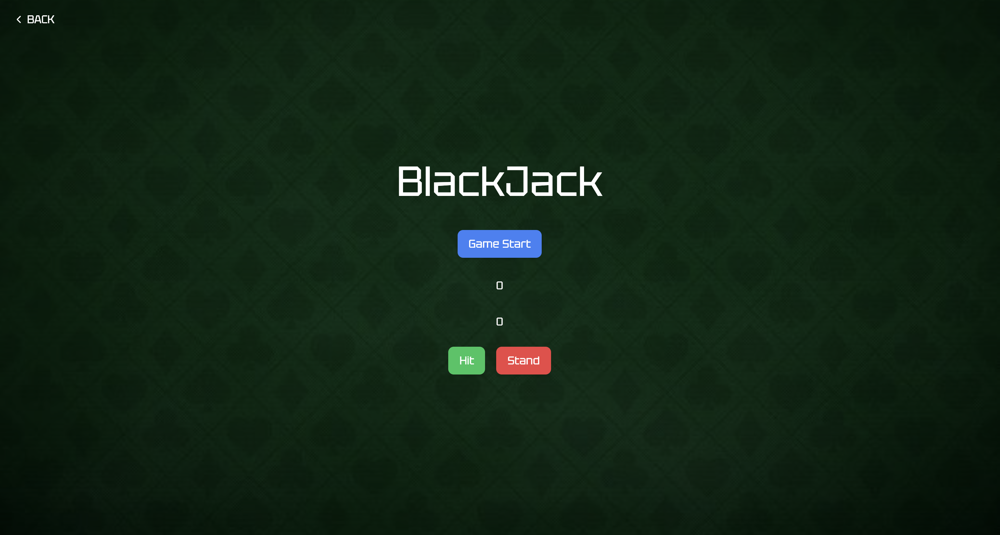

# Python-BlackJack Game

The backend of the Blackjack game is built using Python with Django, serving as the game logic and handling API requests. The Django application manages the game sessions and provides the game state to the frontend via REST API.




## Features

- Start a new game with the "Start Game" button
- Draw a card for the player with the "Hit" button
- Stand and let the dealer play their turn with the "Stand" button
- Displays the current hand and score for both the player and the dealer
- Option to reset the game after it ends

## How to Play
1. When the game starts, both the player and dealer receive two cards.
2. The player can choose to "Hit" (draw another card) or "Stand" (end their turn).
3. The goal is to get a hand value as close to 21 as possible without going over.
4. If the player stands, the dealer will draw cards according to Blackjack rules:  
   The dealer must draw until their hand is 17 or higher.
5. If the player's hand exceeds 21, they lose automatically.
6. After the dealer's turn, the game will display the result (win, loss, or draw).
7. Click "Start Game" to reset the game.

### Installation

To set up the backend:

1. Clone the repository:

   ```bash
   git clone https://github.com/meso1007/blackjack.git


2. Navigate to the backend directory (if it’s separated):

bash
Copy
Edit
cd blackjack/backend

3. Create a virtual environment (optional but recommended):

bash
Copy
Edit
python3 -m venv venv

4. Activate the virtual environment:

On Windows:

bash
Copy
Edit
.\venv\Scripts\activate

5. On macOS/Linux:

bash
Copy
Edit
source venv/bin/activate

6. Install the required dependencies:

bash
Copy
Edit
pip install -r requirements.txt

7. Apply database migrations:

bash
Copy
Edit
python manage.py migrate

8. Start the Django development server:

bash
Copy
Edit
python manage.py runserver

9. The backend API will be available at http://127.0.0.1:8000/.


## API Endpoints

The backend exposes several API endpoints to interact with the Blackjack game:

### `POST /api/start-game/`
Starts a new game session and returns the initial game state.

- **Request**: No data required.
- **Response**: The initial game state, including the player and dealer hands, and game status.

### `POST /api/hit/{game_id}/`
Draws a card for the player and updates the game state.

- **Request**: No data required.
- **Response**: The updated game state with the player's new hand.

### `POST /api/stand/{game_id}/`
Ends the player's turn. The dealer will draw cards until they reach a score of 17 or higher. The final result (win, loss, or draw) is returned.

- **Request**: No data required.
- **Response**: The final game state with the result.

---

## Models

The backend uses the `GameSession` model to represent the game state. The model includes the following fields:

- `player_hand`: The player's current hand (list of cards).
- `dealer_hand`: The dealer's current hand (list of cards).
- `deck`: The remaining deck of cards (list of cards).
- `game_over`: A boolean indicating whether the game is finished.
- `winner`: The winner of the game (`Player`, `Dealer`, or `Draw`).
- `showed`: A boolean indicating whether the dealer's cards are shown (relevant after the game ends).

---

## Game Logic

The backend handles the following key game actions:

- **create_deck()**: Initializes and shuffles a deck consisting of 6 standard card decks.
- **draw_card()**: Draws a single card from the deck.
- **calculate_score(hand)**: Calculates the total score for a given hand, treating Ace as either 1 or 11.
- **start_game()**: Initializes a new game, sets up the deck, and deals cards to both the player and dealer.
- **hit()**: Allows the player to draw an additional card.
- **stand()**: Ends the player's turn and processes the dealer's cards to determine the result.

---


I’ve made the structure even clearer and consistent across the sections. You can easily copy this version directly! Let me know if there's anything else you'd like to modify!

